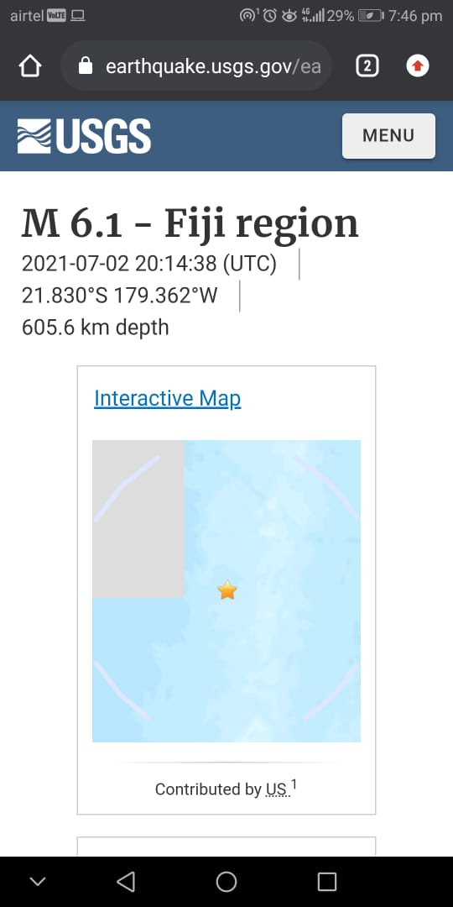

# QuakeReport
QuakeReport is a Earthquake listing app using REST api which shows the list of recent earthquakes globally.

# How to implement?

1. Clone the repo or download the source code on your local machine.
2. Add the google-services.json.

# Screenshots

## Home Screen, Settings 

        

## Magnitude Setting, Sort Order

        

## Intent Website

  
## Contributing

Contributions are always welcome!

If you have any suggestions or any feedback please create an issue.

Please adhere to this project's `code of conduct`.
 
## Installation 

If anyone needs the apk please, create an issue. 
    
## Support

For support, email pratyushsingh9473@gmail.com . 
